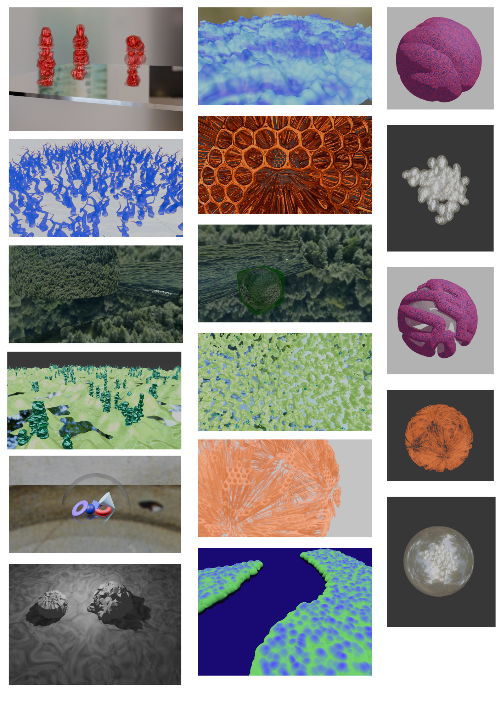
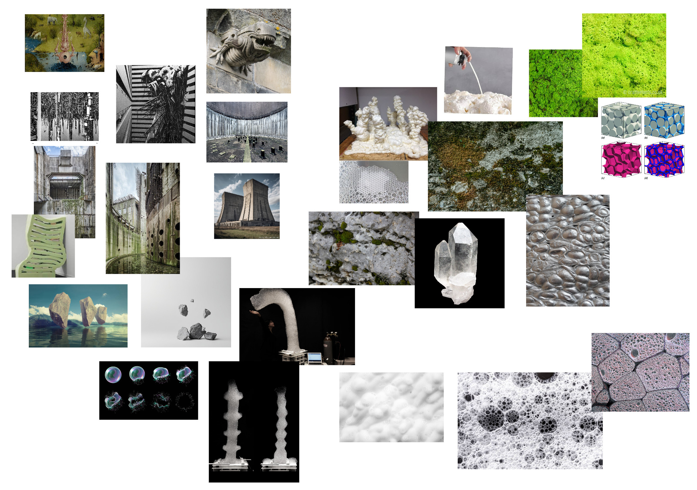
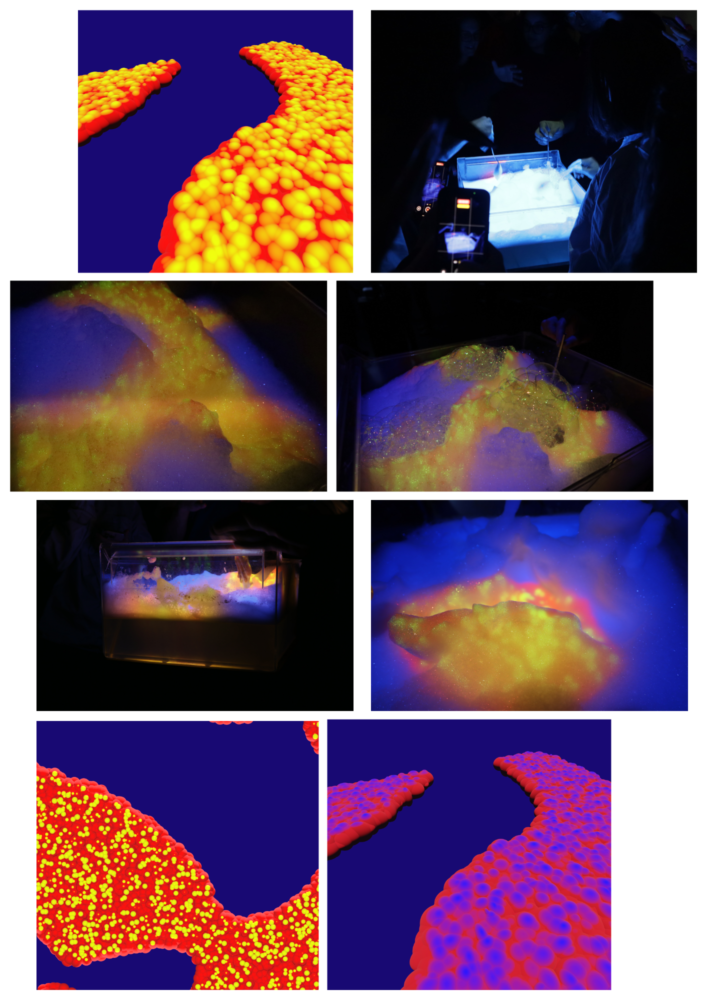

# Invisible Cities workshop

November 2025. 
HEAD Media Design Master Blender 1 week workshop on building Invisible Cities by Italo Clavino. 

[Here](https://drive.switch.ch/index.php/s/Ncs5WrPaIbbjoQC?path=%2Finvisible-cities) the link to all presentations, files, documentation. 

In groups, we built both digital and physical conceptions of Invisible Cities. Our city was named Expansia. 

## Expansia

Expansia is a grotesque, mineral-brutalist city whose growth is governed entirely by its power plant.

At the heart of the landscape stand monumental chimneys, exhaling floating rock-bubbles: stones that drift through the air before popping like delicate, ephemeral soap bubbles.

The plant itself glows with a crystalline, mineral radiance. At the base of the chimneys, transparent crystals emerge and swell outward, each one filled with slowly growing foam.

This foam trickles down the chimneys’ surfaces, accumulating into pools of mineral froth that pulse and expand.  From this ever-growing foam, the city is born.

As the foam settles on the ground, it begins to harden, crystallizing into newly formed buildings. The process never stops. Entire structures dissolve beneath the froth, only to be replaced by new formations. The city is in constant metamorphosis: a living organism, expanding and erasing itself simultaneously.

Rock-bubbles drift overhead, foam grows like stone, minerals shine at the core. 

## Blender creations

## Expansia moodboard

## Expansia archive pictures

